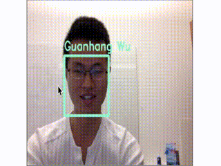
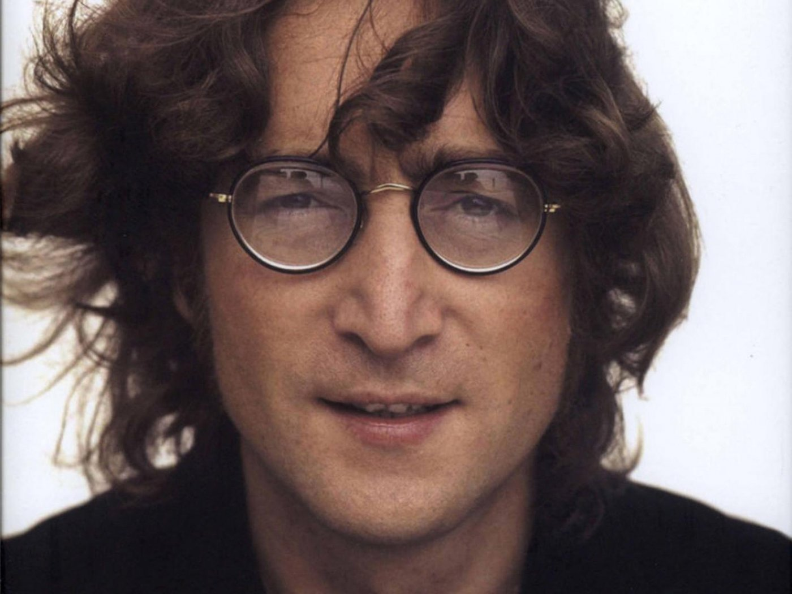
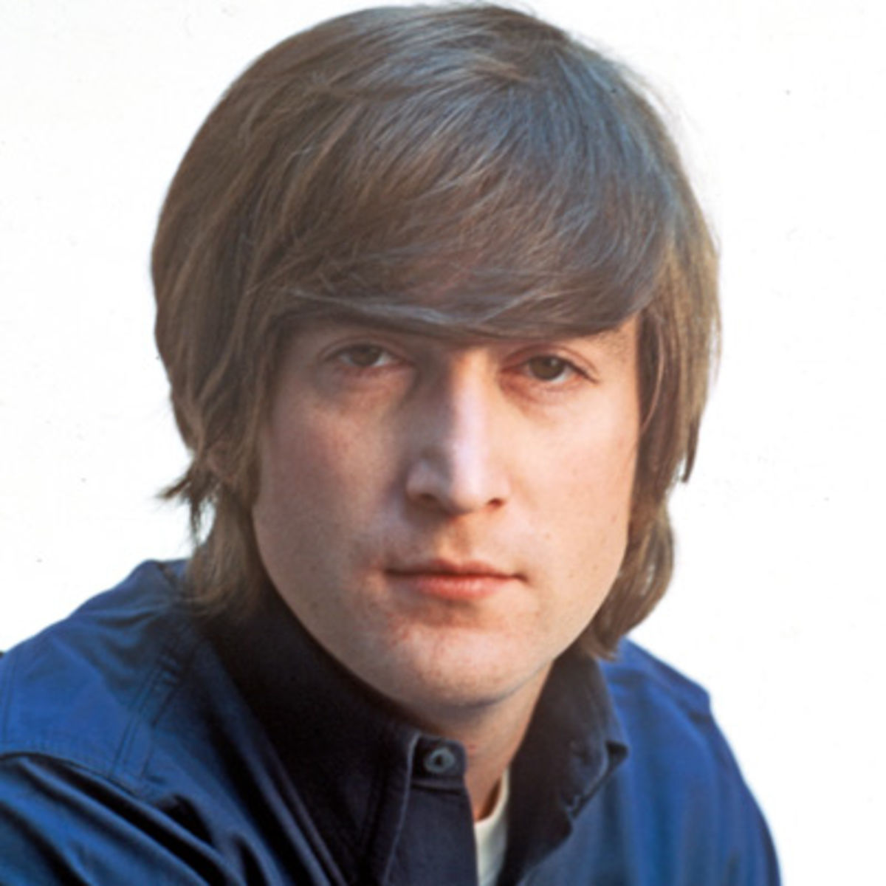
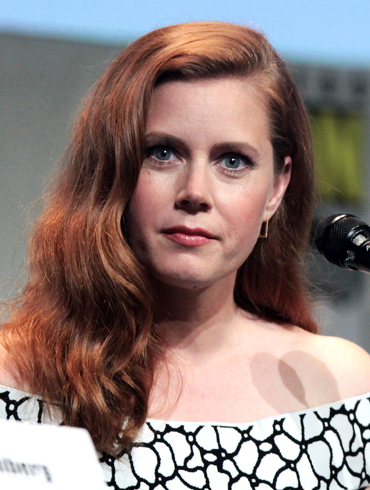
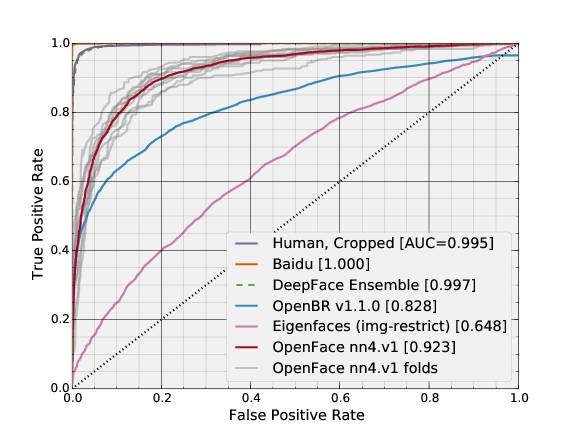
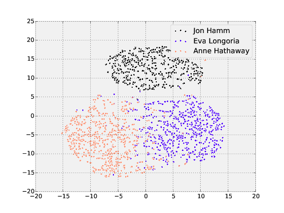
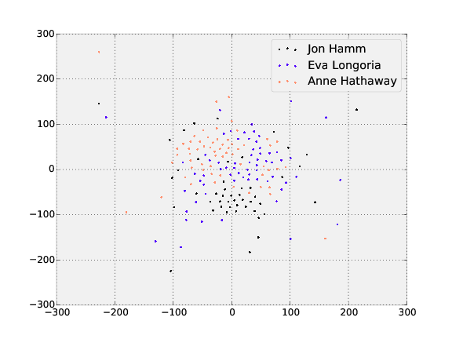
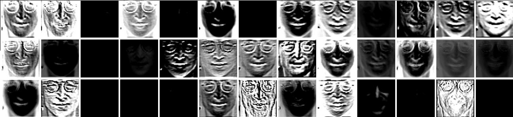
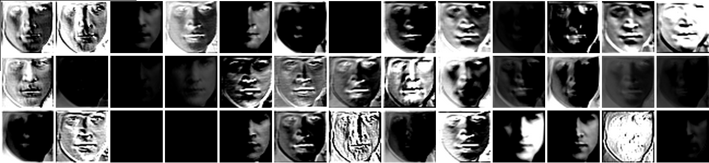
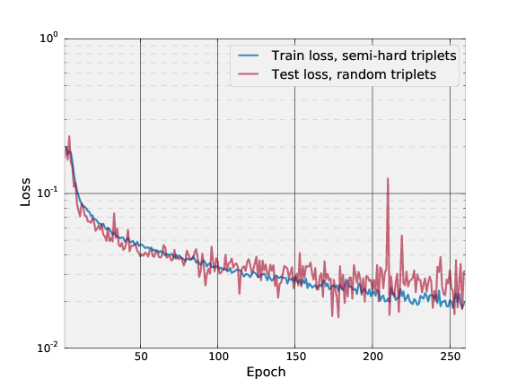

# OpenFace

[ ![Build Status] [travis-image] ] [travis]
[ ![Release] [release-image] ] [releases]
[ ![License] [license-image] ] [license]
[ ![DOI] [doi-image] ] [doi]
[ ![Gitter] [gitter-image] ] [gitter]

[travis-image]: https://travis-ci.org/cmusatyalab/openface.png?branch=master
[travis]: http://travis-ci.org/cmusatyalab/openface

[release-image]: http://img.shields.io/badge/release-0.1.1-blue.svg?style=flat
[releases]: https://github.com/cmusatyalab/openface/releases

[license-image]: http://img.shields.io/badge/license-Apache--2-blue.svg?style=flat
[license]: LICENSE

[doi-image]: https://zenodo.org/badge/doi/10.5281/zenodo.32148.svg
[doi]: http://dx.doi.org/10.5281/zenodo.32148

[gitter-image]: https://badges.gitter.im/Join%20Chat.svg
[gitter]: https://gitter.im/cmusatyalab/openface

This is a Python and [Torch](http://torch.ch) implementation of the CVPR 2015 paper
[FaceNet: A Unified Embedding for Face Recognition and Clustering](http://www.cv-foundation.org/openaccess/content_cvpr_2015/app/1A_089.pdf)
by Florian Schroff, Dmitry Kalenichenko, and James Philbin at Google
using publicly available libraries and datasets.
Torch allows the network to be executed on a CPU or with CUDA.

**Crafted by [Brandon Amos](http://bamos.github.io) in the
[Elijah](http://elijah.cs.cmu.edu) research group at
Carnegie Mellon University.**

---

### Isn't face recognition a solved problem?
No! Accuracies from research papers have just begun to surpass
human accuracies on some benchmarks.
The accuracies of open source face recognition systems lag
behind the state-of-the-art.
See our accuracy comparisons on the famous LFW benchmark below.

---

### Please use responsibly!

We do not support the use of this project in applications
that violate privacy and security.
We are using this to help cognitively impaired users to
sense and understand the world around them.

---

# Overview

The following overview shows the workflow for a single input
image of Sylvestor Stallone from the publicly available
[LFW dataset](http://vis-www.cs.umass.edu/lfw/person/Sylvester_Stallone.html).

1. Detect faces with a pre-trained models from
  [dlib](http://blog.dlib.net/2014/02/dlib-186-released-make-your-own-object.html)
  or
  [OpenCV](http://docs.opencv.org/master/d7/d8b/tutorial_py_face_detection.html).
2. Transform the face for the neural network.
   This repository uses dlib's
   [real-time pose estimation](http://blog.dlib.net/2014/08/real-time-face-pose-estimation.html)
   with OpenCV's
   [affine transformation](http://docs.opencv.org/doc/tutorials/imgproc/imgtrans/warp_affine/warp_affine.html)
   to try to make the eyes and nose appear in
   the same location on each image.
3. Use a deep neural network to represent (or embed) the face on
   a 128-dimensional unit hypersphere.
   The embedding is a generic representation for anybody's face.
   Unlike other face representations, this embedding has the nice property
   that a larger distance between two face embeddings means
   that the faces are likely not of the same person.
   This property makes clustering, similarity detection,
   and classification tasks easier than other face recognition
   techniques where the Euclidean distance between
   features is not meaningful.
4. Apply your favorite clustering or classification techniques
   to the features to complete your recognition task.
   See below for our examples for classification and
   similarity detection, including an online web demo.


# What's in this repository?
+ [batch-represent](/batch-represent): Generate representations from
  a batch of images, stored in a directory by names.
+ [demos/web](/demos/web): Real-time web demo.
+ [demos/compare.py](/demos/compare.py): Demo to compare two images.
+ [demos/vis-outputs.lua](/demos/vis-outputs.lua): Demo to
  visualize the network's outputs.
+ [demos/classifier.py](/demos/classifier.py): Demo to train and use classifiers.
+ [evaluation](/evaluation): LFW accuracy evaluation scripts.
+ [openface](/openface): Python library code.
+ [images](/images): Images used in the README.
+ [models](/models): Model directory for openface and 3rd party libraries.
+ [training](/training): Scripts to train new OpenFace models.
+ [util](/util): Utility scripts.

# Demo 1: Real-Time Web Demo
See [our YouTube video](https://www.youtube.com/watch?v=LZJOTRkjZA4)
of using this in a real-time web application
for face recognition.
The source is available in [demos/web](/demos/web).


<a href='https://www.youtube.com/watch?v=LZJOTRkjZA4'></img></a>

This demo does the full face recognition pipeline on every frame.
In practice, object tracking
[like dlib's](http://blog.dlib.net/2015/02/dlib-1813-released.html)
should be used once the face recognizer has predicted a face.

To run on your system, after following the setup directions
below, install the requirements for the web demo with
`./install-deps.sh` and `sudo pip install -r requirements.txt`
from the `demos/web` directory.
The application is split into a processing server and static
web pages that communicate via web sockets.
Start the server with `./demos/web/server.py` and
serve the static website with `python2 -m SimpleHTTPServer 8000`
from the `/demos/web` directory.
You should now be able to access the demo from your browser
at `http://localhost:8000`.
The saved faces are only available for the browser session.

# Demo 2: Comparing two images
The [comparison demo](demos/compare.py) outputs the predicted similarity
score of two faces by computing the squared L2 distance between
their representations.
A lower score indicates two faces are more likely of the same person.
Since the representations are on the unit hypersphere, the
scores range from 0 (the same picture) to 4.0.
The following distances between images of John Lennon and
Eric Clapton were generated with
`./demos/compare.py images/examples/{lennon*,clapton*}`.

| Lennon 1 | Lennon 2 | Clapton 1 | Clapton 2 |
|---|---|---|---|
| </img> | </img> | </img> | </img> |

The following table shows that a distance threshold of `0.5` would
distinguish these two people.
In practice, further experimentation should be done on the distance threshold.
On our LFW experiments, the mean threshold across multiple
experiments is 0.71 &plusmn; 0.027,
see [accuracies.txt](evaluation/lfw.nn4.v1.epoch-177/accuracies.txt).

| Image 1 | Image 2 | Distance |
|---|---|---|
| Lennon 1 | Lennon 2 | 0.310 |
| Lennon 1 | Clapton 1 | 1.241 |
| Lennon 1 | Clapton 2 | 1.056 |
| Lennon 2 | Clapton 1 | 1.386 |
| Lennon 2 | Clapton 2 | 1.073 |
| Clapton 1 | Clapton 2 | 0.259 |

# Demo 3: Training a Classifier
OpenFace's core provides a feature extraction method to
obtain a low-dimensional representation of any face.
[demos/classifier.py](demos/classifier.py) shows a demo of
how these representations can be used to create a face classifier.

This is trained on about 6000 total images of the following people,
which are the people with the most images in our dataset.
Classifiers can be created with far less images per
person.

+ America Ferrera
+ Amy Adams
+ Anne Hathaway
+ Ben Stiller
+ Bradley Cooper
+ David Boreanaz
+ Emily Deschanel
+ Eva Longoria
+ Jon Hamm
+ Steve Carell

This demo uses [scikit-learn](http://scikit-learn.org) to perform
a grid search over SVM parameters.
For 1000's of images, training the SVMs takes seconds.
Our trained model obtains 87% accuracy on this set of data.
[models/get-models.sh](models/get-models.sh)
will automatically download this classifier and place
it in `models/openface/celeb-classifier.nn4.v1.pkl`.

For an example, consider the following small set of images
the model has no knowledge of.
For an unknown person, a prediction still needs to be made, but
the confidence score is usually lower.

Run the classifier on your images with:

```
./demos/classifier.py infer ./models/openface/celeb-classifier.nn4.v1.pkl ./your-image.png
```

| Person | Image | Prediction | Confidence |
|---|---|---|---|
| Carell | </img> | SteveCarell | 0.78 |
| Adams | </img> | AmyAdams | 0.87 |
| Lennon 1 (Unknown) | </img> | DavidBoreanaz | 0.28 |
| Lennon 2 (Unknown) | </img> | DavidBoreanaz | 0.56 |

# Cool demos, but I want numbers. What's the accuracy?
Even though the public datasets we trained on have orders of magnitude less data
than private industry datasets, the accuracy is remarkably high
on the standard
[LFW](http://vis-www.cs.umass.edu/lfw/results.html)
benchmark.
We had to fallback to using the deep funneled versions for
152 of 13233 images because dlib failed to detect a face or landmarks.
We obtain a mean accuracy of 0.8483 &plusmn; 0.0172 with an AUC of 0.923.
For comparison, training with Google-scale data results in an
accuracy of .9963 &plusmn; 0.009.



This can be generated with the following commands from the root `openface`
directory, assuming you have downloaded and placed the raw and
deep funneled LFW data from [here](http://vis-www.cs.umass.edu/lfw/)
in `./data/lfw/raw` and `./data/lfw/deepfunneled`.

1. Install prerequisites as below.
2. Preprocess the raw `lfw` images, change `8` to however many
   separate processes you want to run:
   `for N in {1..8}; do ./util/align-dlib.py data/lfw/raw align affine data/lfw/dlib-affine-sz:96 --size 96 &; done`.
   Fallback to deep funneled versions for images that dlib failed
   to align:
   `./util/align-dlib.py data/lfw/raw align affine data/lfw/dlib-affine-sz:96 --size 96 --fallbackLfw data/lfw/deepfunneled`
3. Generate representations with `./batch-represent/main.lua -outDir evaluation/lfw.nn4.v1.reps -model models/openface/nn4.v1.t7 -data data/lfw/dlib-affine-sz:96`
4. Generate the ROC curve from the `evaluation` directory with `./lfw-roc.py --workDir lfw.nn4.v1.reps`.
   This creates `roc.pdf` in the `lfw.nn4.v1.reps` directory.

---

If you're interested in higher accuracy open source code, see:

1. [Oxford's VGG Face Descriptor](http://www.robots.ox.ac.uk/~vgg/software/vgg_face/),
  which is licensed for non-commercial research purposes.
  They've released their softmax network, which obtains .9727 accuracy
  on the LFW and will release their triplet network (0.9913 accuracy)
  and data soon.

  Their softmax model doesn't embed features like FaceNet,
  which makes tasks like classification and clustering more difficult.
  Their triplet model hasn't yet been released, but will provide
  embeddings similar to FaceNet.
  The triplet model will be supported by OpenFace once it's released.
2. [AlfredXiangWu/face_verification_experiment](https://github.com/AlfredXiangWu/face_verification_experiment),
  which uses Caffe and doesn't yet have a license.
  The accuracy on the LFW is .9777.
  This model doesn't embed features like FaceNet,
  which makes tasks like classification and clustering more difficult.

# Help Wanted!
As the following table shows, the forefront of deep learning research
is driven by large private datasets.
In face recognition, there are no open source implementations or
models trained on these datasets.
If you have access to a large dataset, we are very interested
in training a new OpenFace model with it.
Please contact Brandon Amos at [bamos@cs.cmu.edu](mailto:bamos@cs.cmu.edu).

| Dataset | Public | #Photos | #People |
|---|---|---|---|
| [DeepFace](https://research.facebook.com/publications/480567225376225/deepface-closing-the-gap-to-human-level-performance-in-face-verification/) (Facebook) | No | 4.4 Million | 4k |
| [Web-Scale Training...](http://arxiv.org/abs/1406.5266) (Facebook) | No | 500 Million | 10 Million |
| FaceNet (Google) | No | 100-200 Million | 8 Million |
| [FaceScrub](http://vintage.winklerbros.net/facescrub.html) | Yes | 100k | 500 |
| [CASIA-WebFace](http://arxiv.org/abs/1411.7923) | Yes | 500k | 10k |


# Visualizing representations with t-SNE
[t-SNE](http://lvdmaaten.github.io/tsne/) is a dimensionality
reduction technique that can be used to visualize the
128-dimensional features OpenFace produces.
The following shows the visualization of the three people
in the training and testing dataset with the most images.

**Training**



**Testing**



These can be generated with the following commands from the root
`openface` directory.

1. Install prerequisites as below.
2. Preprocess the raw `lfw` images, change `8` to however many
   separate processes you want to run:
   `for N in {1..8}; do ./util/align-dlib.py <path-to-raw-data> align affine <path-to-aligned-data> --size 96 &; done`.
3. Generate representations with `./batch-represent/main.lua -outDir <feature-directory (to be created)> -model models/openface/nn4.v1.t7 -data <path-to-aligned-data>`
4. Generate t-SNE visualization with `./util/tsne.py <feature-directory> --names <name 1> ... <name n>`
   This creates `tsne.pdf` in `<feature-directory>`.

# Visualizing layer outputs
Visualizing the output feature maps of each layer
is sometimes helpful to understand what features
the network has learned to extract.
With faces, the locations of the eyes, nose, and
mouth should play an important role.

[demos/vis-outputs.lua](demos/vis-outputs.lua)
outputs the feature maps from an aligned image.
The following shows the first 39 filters of the
first convolutional layer on two images
of John Lennon.





# Model Definitions
Model definitions should be kept in [models/openface](models/openface),
where we have provided definitions of the [NN2](models/openface/nn2.def.lua)
and [nn4](models/openface/nn4.def.lua) as described in the paper,
but with batch normalization and no normalization in the lower layers.
The inception layers are introduced  in
[Going Deeper with Convolutions](http://arxiv.org/abs/1409.4842)
by Christian Szegedy et al.

# Pre-trained Models
Pre-trained models are versioned and should be released with
a corresponding model definition.
We currently only provide a pre-trained model for `nn4.v1`
because we have limited access to large-scale face recognition
datasets.

## nn4.v1
This model has been trained by combining the two largest (of August 2015)
publicly-available face recognition datasets based on names:
[FaceScrub](http://vintage.winklerbros.net/facescrub.html)
and [CASIA-WebFace](http://arxiv.org/abs/1411.7923).
This model was trained for about 300 hours on a Tesla K40 GPU.

The following plot shows the triplet loss on the training
and test set.
Each training epoch is defined to be 1000 minibatches, where
each minibatch processes 100 triplets.
Each testing epoch is defined to be 300 minibatches,
where each minibatch processes 100 triplets.
Semi-hard triplets are used on the training set, and
random triplets are used on the testing set.
Our `nn4.v1` model is from epoch 177.

The LFW section above shows that this model obtains a mean
accuracy of 0.8483 &plusmn; 0.0172 with an AUC of 0.923.



# How long does processing a face take?
The processing time depends on the size of your image for
face detection and alignment.
These only run on the CPU and take from 100-200ms to over
a second.
The neural network uses a fixed-size input and has
a more consistent runtime.
Averaging over 500 forward passes of random input, the latency is
77.47 ms &plusmn; 50.69 ms on our 3.70 GHz CPU and
21.13 ms &plusmn; 6.15 ms on our Tesla K40 GPU,
obtained with
[util/profile-network.lua](util/profile-network.lua)

# Usage
## Existing Models
See [the image comparison demo](demos/compare.py) for a complete example
written in Python using a naive Torch subprocess to process the faces.

```Python
import openface
from openface.alignment import NaiveDlib # Depends on dlib.

# `args` are parsed command-line arguments.

align = NaiveDlib(args.dlibFaceMean, args.dlibFacePredictor)
net = openface.TorchWrap(args.networkModel, imgDim=args.imgDim, cuda=args.cuda)

# `img` is a numpy matrix containing the RGB pixels of the image.
bb = align.getLargestFaceBoundingBox(img)
alignedFace = align.alignImg("affine", args.imgDim, img, bb)
rep1 = net.forwardImage(alignedFace)

# `rep2` obtained similarly.
d = rep1 - rep2
distance = np.dot(d, d)
```

# Training new models
This repository also contains our training infrastructure to promote an
open ecosystem and enable quicker bootstrapping for new research and development.
Warning: Training is computationally expensive and takes a few
weeks on our Tesla K40 GPU.

A rough overview of training is:

1. Create a directory for your raw images so that images from different
   people are in different subdirectories. The names of the labels or
   images do not matter, and each person can have a different amount of images.
   The images should be formatted as `jpg` or `png` and have
   a lowercase extension.

   ```
   $ tree data/mydataset/raw
   person-1
   ├── image-1.jpg
   ├── image-2.png
   ...
   └── image-p.png

   ...

   person-m
   ├── image-1.png
   ├── image-2.jpg
   ...
   └── image-q.png
   ```


2. Preprocess the raw images, change `8` to however many
   separate processes you want to run:
   `for N in {1..8}; do ./util/align-dlib.py <path-to-raw-data> align affine <path-to-aligned-data> --size 96 &; done`.
   Prune out directories with less than N (I use 10) images
   per class with `./util/prune-dataset.py <path-to-aligned-data> --numImagesThreshold <N>` and
   then split the dataset into `train` and `val` subdirectories
   with `./util/create-train-val-split.py <path-to-aligned-data> <validation-ratio>`.
3. Run [training/main.lua](training/main.lua) to start training the model.
   Edit the dataset options in [training/opts.lua](training/opts.lua) or
   pass them as command-line parameters.
   This will output the loss and in-progress models to `training/work`.
4. Visualize the loss with [training/plot-loss.py](training/plot-loss.py).

# Setup
The following instructions are for Linux and OSX only.
Please contribute modifications and build instructions if you
are interested in running this on other operating systems.

We strongly recommend using the [Docker](https://www.docker.com/)
container unless you are experienced with building
Linux software from source.

Also note that in OSX, you may have to change the hashbangs
from `python2` to `python`.

## Check out git submodules
Clone with `--recursive` or run `git submodule init && git submodule update`
after checking out.

## Download the models
Run [models/get-models.sh](models/get-models.sh)
to download pre-trained OpenFace
models on the combined CASIA-WebFace and FaceScrub database.
This also downloads dlib's pre-trained model for face landmark detection.
This will incur about 500MB of network traffic for the compressed
models that will decompress to about 1GB on disk.

Be sure the md5 checksums match the following.
Use `md5sum` in Linux and `md5` in OSX.

```
openface(master)$ md5sum models/{dlib/*.dat,openface/*.{pkl,t7}}
73fde5e05226548677a050913eed4e04  models/dlib/shape_predictor_68_face_landmarks.dat
c0675d57dc976df601b085f4af67ecb9  models/openface/celeb-classifier.nn4.v1.pkl
a59a5ec1938370cd401b257619848960  models/openface/nn4.v1.t7
```

## With Docker
This repo can be deployed as a container with [Docker](https://www.docker.com/)
for CPU mode.
Be sure you have checked out the submodules and downloaded
the models as described above.
Depending on your Docker configuration, you may need to
run the docker commands as root.

To use, place your images in `openface` on your host and
access them from the shared Docker directory.

```
docker build -t openface ./docker
docker run -t -i -v $PWD:/openface openface /bin/bash
cd /openface
./demos/compare.py images/examples/{lennon*,clapton*}
```

### Docker in OSX
In OSX, follow the
[Docker Mac OSX Installation Guide](https://docs.docker.com/installation/mac/)
and start a docker machine and connect your shell to it
before trying to build the container.
In the simplest case, this can be done with:

```
docker-machine create --driver virtualbox default
eval $(docker-machine env default)
```

## By hand
Be sure you have checked out the submodules and downloaded the models as
described above.
See the [Dockerfile](docker/Dockerfile) as a reference.

This project uses `python2` because of the `opencv`
and `dlib` dependencies.
Install the packages the Dockerfile uses with your package manager.
With `pip2`, install `numpy`, `pandas`, `scipy`, `scikit-learn`, and `scikit-image`.

Next, manually install the following.

### OpenCV
Download [OpenCV 2.4.11](https://github.com/Itseez/opencv/archive/2.4.11.zip)
and follow their
[build instructions](http://docs.opencv.org/doc/tutorials/introduction/linux_install/linux_install.html).

### dlib
dlib can alternatively by installed from [pypi](https://pypi.python.org/pypi/dlib),
but might be slower than building manually because they are not
compiled with AVX support.

dlib requires boost libraries to be installed.

To build manually, start by
downloading
[dlib v18.16](https://github.com/davisking/dlib/releases/download/v18.16/dlib-18.16.tar.bz2),
then:

```
mkdir -p ~/src
cd ~/src
tar xf dlib-18.16.tar.bz2
cd dlib-18.16/python_examples
mkdir build
cd build
cmake ../../tools/python
cmake --build . --config Release
cp dlib.so ..
```

At this point, you should be able to start your `python2`
interpreter and successfully run `import cv2; import dlib`.

In OSX, you may get a `Fatal Python error: PyThreadState_Get: no current thread`.
You may be able to resolve by rebuilding `python` and `boost-python`
as reported in [#21](https://github.com/cmusatyalab/openface/issues/21),
but please file a new issue with us or [dlib](https://github.com/davisking/dlib)
if you are unable to resolve this.

### Torch
Install [Torch](http://torch.ch) from the instructions on their website
and install the [dpnn](https://github.com/nicholas-leonard/dpnn)
and [nn](https://github.com/torch/nn) libraries with
`luarocks install dpnn` and `luarocks install nn`.

If you want CUDA support, also install
[cudnn.torch](https://github.com/soumith/cudnn.torch).

At this point, the command-line program `th` should
be available in your shell.

# Citations

[](http://dx.doi.org/10.5281/zenodo.32041)

Please cite this repository if you use this in academic works.


```
@misc{amos2015openface,
    author       = {Amos, Brandon and Harkes, Jan and Pillai, Padmanabhan and Elgazzar, Khalid and Satyanarayanan, Mahadev},
    title        = {OpenFace 0.1.1: Face recognition with Google's FaceNet deep neural network},
    month        = oct,
    year         = 2015,
    doi          = {10.5281/zenodo.32148},
    url          = {http://dx.doi.org/10.5281/zenodo.32148}
}
```

# Acknowledgements
+ The fantastic Torch ecosystem and community.
+ [Alfredo Canziani's](https://github.com/Atcold)
  implementation of FaceNet's loss function in
  [torch-TripletEmbedding](https://github.com/Atcold/torch-TripletEmbedding)
+ [Nicholas Léonard](https://github.com/nicholas-leonard)
  for quickly merging my pull requests to
  [nicholas-leonard/dpnn](https://github.com/nicholas-leonard/dpnn)
  modifying the inception layer.
+ [Francisco Massa](https://github.com/fmassa)
  and
  [Andrej Karpathy](http://cs.stanford.edu/people/karpathy/)
  for
  quickly releasing [nn.Normalize](https://github.com/torch/nn/pull/341)
  after I expressed interest in using it.
+ [Soumith Chintala](https://github.com/soumith) for
  help with the [fbcunn](https://github.com/facebook/fbcunn)
  example code.
+ NVIDIA's academic
  [hardware grant program](https://developer.nvidia.com/academic_hw_seeding)
  for providing the Tesla K40 used to train the model.
+ [Davis King's](https://github.com/davisking) [dlib](https://github.com/davisking/dlib)
  library for face detection and alignment.
+ Zhuo Chen, Kiryong Ha, Wenlu Hu,
  [Rahul Sukthankar](http://www.cs.cmu.edu/~rahuls/), and
  Junjue Wang for insightful discussions.

# Licensing
The source code and trained models `nn4.v1.t7` and
`celeb-classifier.nn4.v1.t7` are copyright
Carnegie Mellon University and licensed under the
[Apache 2.0 License](./LICENSE).
Portions from the following third party sources have
been modified and are included in this repository.
These portions are noted in the source files and are
copyright their respective authors with
the licenses listed.

Project | Modified | License
---|---|---|
[Atcold/torch-TripletEmbedding](https://github.com/Atcold/torch-TripletEmbedding) | No | MIT
[facebook/fbnn](https://github.com/facebook/fbnn) | Yes | BSD
