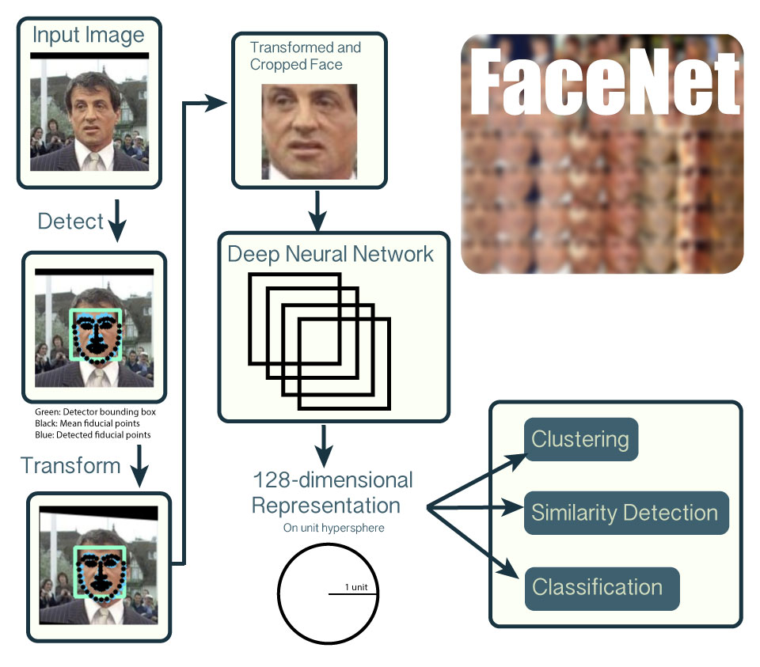

# OpenFace

<iframe src="https://ghbtns.com/github-btn.html?user=cmusatyalab&repo=openface&type=star&count=true&size=large" frameborder="0" scrolling="0" width="160px" height="30px"></iframe>

<iframe src="https://ghbtns.com/github-btn.html?user=bamos&type=follow&count=true&size=large" frameborder="0" scrolling="0" width="220px" height="30px"></iframe>

---

This is the documentation of OpenFace.

The code and issue tracker is available on GitHub at
[cmusatyalab/openface](https://github.com/cmusatyalab/openface).

Please join the
[cmu-openface group](https://groups.google.com/forum/#!forum/cmu-openface)
or the
[gitter chat](https://gitter.im/cmusatyalab/openface)
for discussions and installation issues.

Development discussions and bugs reports are on the
[issue tracker](https://github.com/cmusatyalab/openface/issues).

---

This is a Python and [Torch](http://torch.ch) implementation of the CVPR 2015 paper
[FaceNet: A Unified Embedding for Face Recognition and Clustering](http://www.cv-foundation.org/openaccess/content_cvpr_2015/app/1A_089.pdf)
by Florian Schroff, Dmitry Kalenichenko, and James Philbin at Google
using publicly available libraries and datasets.
Torch allows the network to be executed on a CPU or with CUDA.

**Crafted by [Brandon Amos](http://bamos.github.io) in the
[Elijah](http://elijah.cs.cmu.edu) research group at
Carnegie Mellon University.**

---

### Isn't face recognition a solved problem?
No! Accuracies from research papers have just begun to surpass
human accuracies on some benchmarks.
The accuracies of open source face recognition systems lag
behind the state-of-the-art.
See our accuracy comparisons on the famous LFW benchmark below.

---

### Please use responsibly!

We do not support the use of this project in applications
that violate privacy and security.
We are using this to help cognitively impaired users to
sense and understand the world around them.

---

# Overview

The following overview shows the workflow for a single input
image of Sylvestor Stallone from the publicly available
[LFW dataset](http://vis-www.cs.umass.edu/lfw/person/Sylvester_Stallone.html).

1. Detect faces with a pre-trained models from
  [dlib](http://blog.dlib.net/2014/02/dlib-186-released-make-your-own-object.html)
  or
  [OpenCV](http://docs.opencv.org/master/d7/d8b/tutorial_py_face_detection.html).
2. Transform the face for the neural network.
   This repository uses dlib's
   [real-time pose estimation](http://blog.dlib.net/2014/08/real-time-face-pose-estimation.html)
   with OpenCV's
   [affine transformation](http://docs.opencv.org/doc/tutorials/imgproc/imgtrans/warp_affine/warp_affine.html)
   to try to make the eyes and nose appear in
   the same location on each image.
3. Use a deep neural network to represent (or embed) the face on
   a 128-dimensional unit hypersphere.
   The embedding is a generic representation for anybody's face.
   Unlike other face representations, this embedding has the nice property
   that a larger distance between two face embeddings means
   that the faces are likely not of the same person.
   This property makes clustering, similarity detection,
   and classification tasks easier than other face recognition
   techniques where the Euclidean distance between
   features is not meaningful.
4. Apply your favorite clustering or classification techniques
   to the features to complete your recognition task.
   See below for our examples for classification and
   similarity detection, including an online web demo.



# What's in this repository?
+ [batch-represent](https://github.com/cmusatyalab/openface/tree/master/batch-represent): Generate representations from
  a batch of images, stored in a directory by names.
+ [demos/web](https://github.com/cmusatyalab/openface/tree/master/demos/web): Real-time web demo.
+ [demos/compare.py](https://github.com/cmusatyalab/openface/tree/master/demos/compare.py): Demo to compare two images.
+ [demos/vis-outputs.lua](https://github.com/cmusatyalab/openface/tree/master/demos/vis-outputs.lua): Demo to
  visualize the network's outputs.
+ [demos/classifier.py](https://github.com/cmusatyalab/openface/tree/master/demos/classifier.py): Demo to train and use classifiers.
+ [evaluation](https://github.com/cmusatyalab/openface/blob/master/evaluation): LFW accuracy evaluation scripts.
+ [openface](https://github.com/cmusatyalab/openface/tree/master/openface): Python library code.
+ [models](https://github.com/cmusatyalab/openface/tree/master/models): Model directory for openface and 3rd party libraries.
+ [training](https://github.com/cmusatyalab/openface/tree/master/training): Scripts to train new OpenFace models.
+ [util](https://github.com/cmusatyalab/openface/tree/master/util): Utility scripts.

# Citations

[](http://dx.doi.org/10.5281/zenodo.32041)

Please cite this repository if you use this in academic works.


```
@misc{amos2015openface,
    author       = {Amos, Brandon and Harkes, Jan and Pillai, Padmanabhan and Elgazzar, Khalid and Satyanarayanan, Mahadev},
    title        = {OpenFace 0.1.1: Face recognition with Google's FaceNet deep neural network},
    month        = oct,
    year         = 2015,
    doi          = {10.5281/zenodo.32148},
    url          = {http://dx.doi.org/10.5281/zenodo.32148}
}
```

# Acknowledgements
+ The fantastic Torch ecosystem and community.
+ [Alfredo Canziani's](https://github.com/Atcold)
  implementation of FaceNet's loss function in
  [torch-TripletEmbedding](https://github.com/Atcold/torch-TripletEmbedding).
+ [Nicholas Léonard](https://github.com/nicholas-leonard)
  for quickly merging my pull requests to
  [nicholas-leonard/dpnn](https://github.com/nicholas-leonard/dpnn)
  modifying the inception layer.
+ [Francisco Massa](https://github.com/fmassa)
  and
  [Andrej Karpathy](http://cs.stanford.edu/people/karpathy/)
  for
  quickly releasing [nn.Normalize](https://github.com/torch/nn/pull/341)
  after I expressed interest in using it.
+ [Soumith Chintala](https://github.com/soumith) for
  help with the [fbcunn](https://github.com/facebook/fbcunn)
  example code.
+ NVIDIA's academic
  [hardware grant program](https://developer.nvidia.com/academic_hw_seeding)
  for providing the Tesla K40 used to train the model.
+ [Davis King's](https://github.com/davisking) [dlib](https://github.com/davisking/dlib)
  library for face detection and alignment.
+ Zhuo Chen, Kiryong Ha, Wenlu Hu,
  [Rahul Sukthankar](http://www.cs.cmu.edu/~rahuls/), and
  Junjue Wang for insightful discussions.

# Licensing
The source code and trained models `nn4.v1.t7` and
`celeb-classifier.nn4.v1.t7` are copyright
Carnegie Mellon University and licensed under the
[Apache 2.0 License](https://github.com/cmusatyalab/openface/tree/master/LICENSE).
Portions from the following third party sources have
been modified and are included in this repository.
These portions are noted in the source files and are
copyright their respective authors with
the licenses listed.

Project | Modified | License
---|---|---|
[Atcold/torch-TripletEmbedding](https://github.com/Atcold/torch-TripletEmbedding) | No | MIT
[facebook/fbnn](https://github.com/facebook/fbnn) | Yes | BSD
